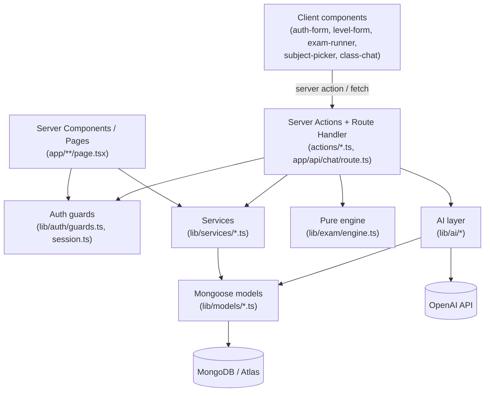
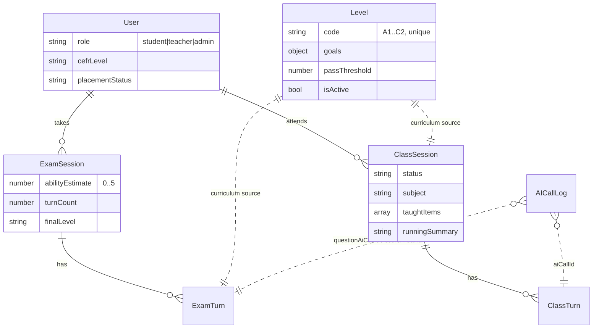
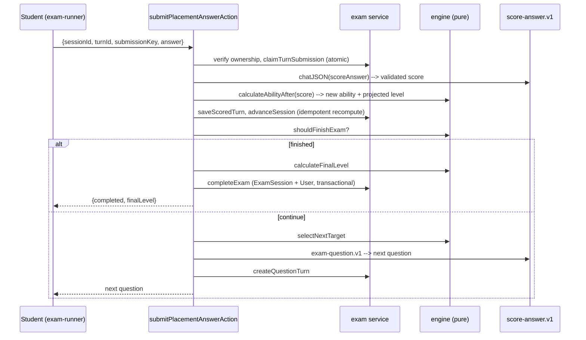
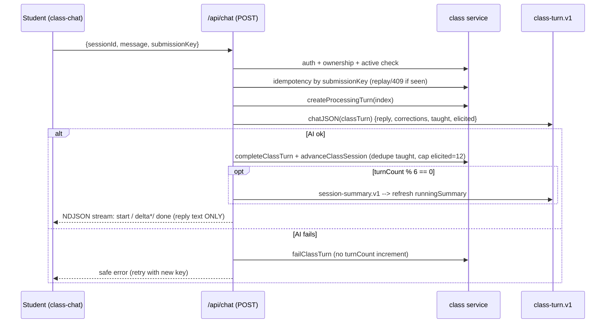

# newinstitute — Architecture & Milestones

An adaptive English-learning platform: self-contained auth, admin-managed CEFR
curriculum, an AI adaptive placement exam, and an AI one-to-one speaking class.

**Stack:** Next.js 16 (App Router, Turbopack) · TypeScript (strict) · MongoDB via
Mongoose · Zod v4 · OpenAI SDK. No third-party auth, no LangchAin/Vercel-AI SDK.

---

## 1. Layered architecture

Every request flows through the same layers. Pages and actions never touch
Mongoose models directly — the **service layer owns all database access**, and
the **AI layer** is the only thing that talks to OpenAI.



**Golden rules enforced across milestones**

- No direct model access from pages or actions — go through a service.
- Client input is always Zod-validated; audit fields (`userId`, `role`, `score`,
  `level`, …) are never accepted from the client.
- Every AI call is logged (redacted) with session/turn context.
- Deterministic decisions (ability, stop rules) live in pure code, never the LLM.

---

## 2. Milestones & file responsibilities

### M0 — Auth, roles & guards

| File | Responsibility |
|------|----------------|
| `lib/models/user.ts` | `User` model: `name`, `email`, `passwordHash`, `role` (student/teacher/admin), `cefrLevel?`, `placementStatus` (pending/completed). |
| `lib/auth/crypto.ts` | Node-`crypto` primitives: scrypt password hash/verify + HMAC-SHA256 JWT sign/verify. |
| `lib/auth/session.ts` | `getCurrentUser()` (React-cached, re-reads Mongo each render), cookie set/clear. `CurrentUser = {id,name,email,role}`. |
| `lib/auth/guards.ts` | `requireUser()` → redirect `/sign-in`; `requireRole(...roles)` → redirect `/` if not allowed. |
| `actions/auth.ts` | `signUpAction` (always role `student`), `signInAction`, `signOutAction`. |
| `lib/validation/auth.ts` | Zod sign-up / sign-in schemas. |
| `lib/db/mongoose.ts` | `connectToDatabase()` — single cached connection (survives dev hot-reload). |
| `lib/env.ts` | Zod-validated server-only environment. |
| `scripts/seed-admin.ts` | Upserts an admin + teacher from `SEED_*` env vars. |
| `components/auth-form.tsx`, `app/(auth)/**` | Sign-in / sign-up UI. |

### M1 — Provider-neutral AI foundation

| File | Responsibility |
|------|----------------|
| `lib/ai/types.ts` | Provider-neutral types: `AIMessage`, `AIChatOptions`, `AIChatResult`, `AIJSONResult<T>`, `PromptIdentity`. No OpenAI types leak here. |
| `lib/ai/provider.ts` | `AIProvider` interface: `chat()` + `chatJSON<T>(options, schema)`. |
| `lib/ai/providers/openai.ts` | OpenAI adapter. Maps neutral messages → OpenAI request, normalizes text/usage, runs **one** structured-output repair retry, logs every call. SDK client stays private. |
| `lib/ai/client.ts` | `getAIProvider()` — selects provider by `AI_PROVIDER` (only `openai`), cached singleton. |
| `lib/ai/json.ts` | Pure structured-output parser: strip markdown fence → `JSON.parse` → Zod validate → one injected repair retry → typed `AIJSONParseError`. No DB/OpenAI imports. |
| `lib/ai/logger.ts` | Recursive secret **redaction** + best-effort `AICallLog` persistence. Never masks the original AI error. |
| `lib/models/ai-call-log.ts` | `AICallLog` model: provider/model/operation, redacted messages/response, parsed output, usage, latency, context IDs, safe error. |
| `lib/schemas/ai.ts` | Shared Zod: roles, messages, usage, context, smoke-test result. |
| `lib/ai/prompts/*.v1.ts` | Versioned, **pure** prompt modules (each exports `promptIdentity`, `buildMessages`, and — for structured prompts — a Zod output schema): `exam-question`, `score-answer`, `class-turn`, `session-summary`, `subject-picker`. |
| `scripts/smoke-ai.ts` | CLI smoke test: `chat()` + `chatJSON()` + confirms both logs exist. |

### M2 — CEFR level content management

| File | Responsibility |
|------|----------------|
| `lib/models/level.ts` | `Level` model per CEFR code (unique, immutable): name, description, `goals{grammar,vocabulary,functions}`, `canDoStatements`, `passThreshold` (0–1), `isActive`, audit refs. |
| `lib/schemas/level.ts` | `cefrCodeSchema`, `levelInputSchema`, `createLevelSchema`, `updateLevelSchema` (trims, dedupes, rejects `code`/audit fields on update). |
| `lib/services/level.ts` | `listLevels`, `getLevelByCode`, `createLevel`, `updateLevel` → plain `LevelDTO`s; conflict error on duplicate code. |
| `actions/level.ts` | `createLevelAction` (admin), `updateLevelAction` (admin/teacher); Zod-validate, derive actor from session, revalidate paths. |
| `app/admin/levels/**` | List table, create page (only unused codes), edit-by-code page. |
| `components/levels/level-form.tsx` | Shared create/edit form (textarea-per-line arrays). |
| `scripts/seed-levels.ts` | Seeds A1–C2 placeholders; never overwrites existing. |

### M3 — Adaptive CEFR placement exam

| File | Responsibility |
|------|----------------|
| `lib/exam/engine.ts` | **Pure deterministic engine**: `abilityToLevel`, `selectNextTarget`, `calculateAbilityAfter`, `shouldFinishExam`, `calculateFinalLevel`. No Mongo/AI/random. |
| `lib/models/exam-session.ts` | `ExamSession`: ability (0–5, init 1.5), turnCount, projected levels, covered goal keys, final level. Partial-unique: one active session/user. |
| `lib/models/exam-turn.ts` | `ExamTurn`: question, answer, AI score, confidence, `needsTeacherReview`, ability before/after, AI-call refs. Unique `{sessionId,index}` and partial-unique `{sessionId,submissionKey}`. |
| `lib/schemas/exam.ts` | `startExamSchema`, `submitExamAnswerSchema` (ObjectId strings, answer 1–5000, strict). |
| `lib/services/exam.ts` | All exam DB ops: session/turn CRUD, atomic `claimTurnSubmission`, `saveScoredTurn`, idempotent `advanceSession` (recomputes from scored turns), transactional `completeExam` (updates ExamSession **and** User). |
| `actions/exam.ts` | `startPlacementExamAction`, `submitPlacementAnswerAction` — orchestrate engine + AI + service, fully idempotent. |
| `app/placement/**`, `components/exam/exam-runner.tsx` | Student exam UI (one question at a time, hides ability/score) + result page. |

### M4 — AI speaking class

| File | Responsibility |
|------|----------------|
| `lib/models/class-session.ts` | `ClassSession`: level, status (choosing→active→completed), offered subjects, chosen subject, targeted goals, accumulated `taughtItems`, `pendingElicitedTargets`, `runningSummary`, `finalSummary`. Partial-unique: one open session/user. |
| `lib/models/class-turn.ts` | `ClassTurn`: student message + AI reply, corrections, taught-in-turn, elicited targets. Unique `{sessionId,index}` and `{sessionId,submissionKey}`. |
| `lib/schemas/class.ts` | `selectSubjectSchema`, `classMessageSchema`, `completeClassSchema` (strict). |
| `lib/services/class.ts` | All class DB ops: open/by-id/completed lookups, subject offer/activate, turn create/complete/fail, idempotent `advanceClassSession` (recompute turnCount, dedupe taught items), `completeClassSession`. |
| `actions/class.ts` | `prepareClassSubjectsAction` (4 subjects, reuses stored), `selectClassSubjectAction`, `completeClassAction` (session summary). |
| `app/api/chat/route.ts` | POST chat turn: auth + ownership, idempotency by submission key, `class-turn.v1` AI call, persist turn, advance session, **periodic running-summary refresh every 6 turns**, then stream the reply as NDJSON. |
| `app/class/**`, `components/class/{subject-picker,class-chat}.tsx` | Entry/subject-pick, active chat (NDJSON progressive render), completed summary. |

---

## 3. Data model & relationships



- **Placement → class link:** completing the exam sets `User.cefrLevel` +
  `placementStatus=completed`; the class layer reads the completed exam to gate
  access and choose the CEFR level.
- **AICallLog** is referenced by exam/class turns via call-ID fields, so every
  AI interaction is auditable without duplicating prompt text into domain data.

---

## 4. Key data flows

### 4.1 Sign-up / sign-in
`auth-form` → `signUpAction`/`signInAction` → Zod validate → `User` via Mongo →
scrypt verify → signed JWT cookie. `getCurrentUser()` re-reads Mongo each render.

### 4.2 Level management
`level-form` → `create/updateLevelAction` → `requireRole` → Zod → `lib/services/level` →
`Level` model → `revalidatePath('/admin/levels')`.

### 4.3 Every AI call (M1 core)
```
caller → getAIProvider().chatJSON(options, schema)
      → OpenAI adapter: build request → OpenAI
      → normalize text/usage
      → lib/ai/json: parse + validate  ──(invalid)──► ONE repair request ──► re-validate
      → lib/ai/logger: redact + save AICallLog (with context IDs)
      → return { data, text, usage, logId }
```
Redaction strips passwords, tokens, API keys, cookies, bearer strings; logging
failure never replaces the original AI/parse error.

### 4.4 Adaptive placement exam (one answer → one turn)

Stop rules: finish at 12 turns, or after 8 turns when the last 3 projected levels
are identical and confident (≥0.60). Ability/level are computed only in the engine.

### 4.5 Speaking class turn (streamed)

The stream carries **only reply text** — corrections, taught items, prompts, AI
JSON, call IDs, and token counts are never sent to the browser. Ending the class
calls `session-summary.v1` once and shows a compact "What you learned" page.

---

## 5. Determinism, idempotency & safety

- **Deterministic core:** ability update, target selection, and stop/final-level
  rules are pure functions in `lib/exam/engine.ts` — the LLM never sets them.
- **Idempotency:** exam turns and class turns key on a client `submissionKey`;
  session aggregates are *recomputed* from stored turns, so retries never
  double-count. Duplicate open sessions/turns resolve to the existing record.
- **Ownership:** every session/turn query includes the authenticated user ID;
  the chat route re-authenticates and never trusts client-supplied user/level.
- **Auditability:** every AI call → one redacted `AICallLog` with user/session/
  turn context.

---

## 6. Ops / scripts

| Command | Purpose |
|---------|---------|
| `npm run dev` / `build` / `lint` | Standard Next.js. |
| `npm run ai:smoke` | End-to-end AI + Mongo smoke test. |
| `npm run seed:levels` | Seed A1–C2 curriculum placeholders (idempotent). |
| `tsx scripts/seed-admin.ts` | Seed admin + teacher accounts. |

Environment (`.env`): `MONGODB_URI`, `AUTH_SECRET`, `OPENAI_API_KEY`,
`AI_PROVIDER=openai`, `AI_GENERATION_MODEL`, `AI_SCORING_MODEL`, `SEED_*`.
