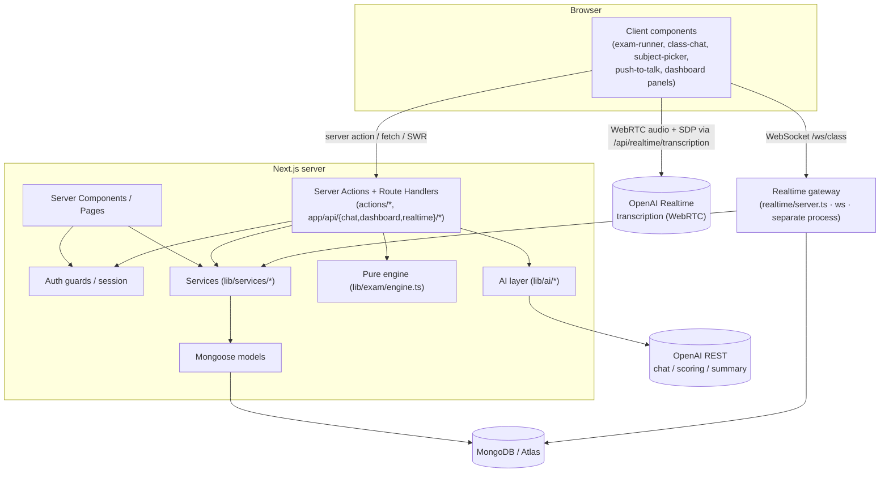
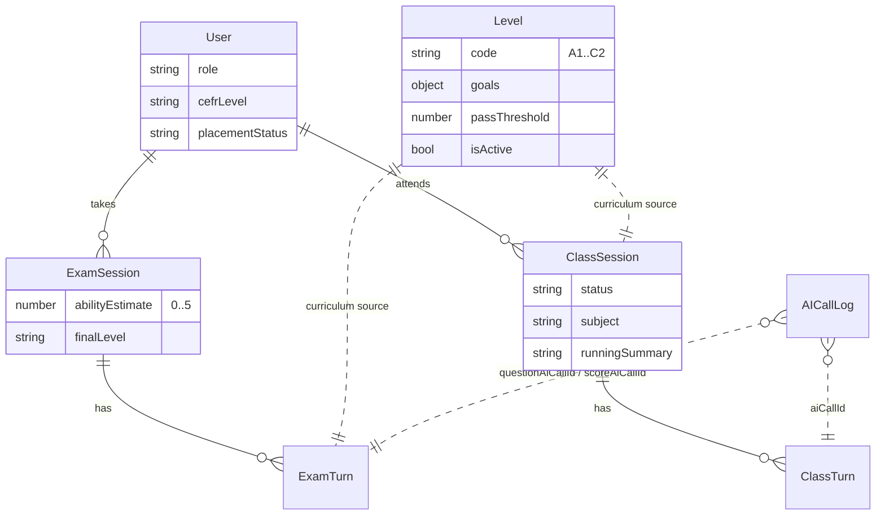
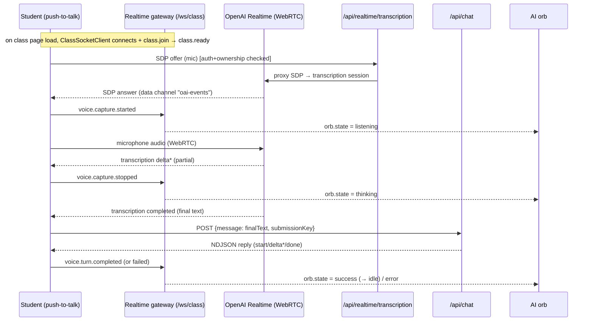

# newinstitute — Architecture & Milestones

An adaptive English-learning platform: self-contained auth, admin-managed CEFR
curriculum, an AI adaptive placement exam, an AI one-to-one speaking class with
**live voice transcription**, and role-aware **dashboards**.

**Stack:** Next.js 16 (App Router, Turbopack) · TypeScript (strict) · MongoDB via
Mongoose · Zod v4 · OpenAI SDK (REST) + OpenAI Realtime (WebRTC) · `ws`
(WebSocket gateway) · `swr` (client cache). No third-party auth, no
Langchain/Vercel-AI SDK.

---

## 1. Layered architecture

Pages and actions never touch Mongoose models directly — the **service layer
owns all database access**, the **AI layer** is the only thing that talks to the
OpenAI REST API, and a **separate realtime gateway** owns the live socket.



**Golden rules enforced across milestones**

- No direct model access from pages/actions — go through a service.
- Client input is always Zod-validated; audit fields (`userId`, `role`, `score`,
  `level`, …) are never accepted from the client.
- Every AI **REST** call is logged (redacted) with session/turn context.
- Deterministic decisions (ability, stop rules) live in pure code, never the LLM.
- Audio never touches our servers — it flows browser ↔ OpenAI over WebRTC; we
  only broker the SDP handshake.

### Runtime processes

| Process | Command | Role |
|---------|---------|------|
| Next.js app | `npm run dev` / `start` | Pages, server actions, `/api/*` route handlers. |
| Realtime gateway | `npm run realtime:gateway` | Standalone `ws` server on `REALTIME_PORT` (`/ws/class`) for class orb/voice signalling. **Not** part of the Next server. |
| OpenAI REST | — | Question / scoring / class / summary / subject calls (logged). |
| OpenAI Realtime | — | Live transcription over WebRTC, brokered by `/api/realtime/transcription`. |

---

## 2. Milestones & file responsibilities

### M0 — Auth, roles & guards

| File | Responsibility |
|------|----------------|
| `lib/models/user.ts` | `User`: `name`, `email`, `passwordHash`, `role`, `cefrLevel?`, `placementStatus`, profile fields. |
| `lib/auth/crypto.ts` | scrypt hash/verify + HMAC-SHA256 JWT sign/verify. |
| `lib/auth/constants.ts` | Shared `SESSION_COOKIE` name (used by session **and** realtime auth). |
| `lib/auth/session.ts` | `getCurrentUser()` (React-cached), cookie set/clear. `CurrentUser = {id,name,email,role}`. |
| `lib/auth/guards.ts` | `requireUser()` / `requireRole(...roles)`. |
| `actions/auth.ts`, `lib/validation/auth.ts`, `components/auth-form.tsx`, `app/(auth)/**` | Sign-up/in/out + UI. |
| `lib/db/mongoose.ts` | `connectToDatabase()` — cached connection. |
| `lib/env.ts` | Zod-validated server-only environment (grows every milestone). |
| `scripts/seed-admin.ts` | Upserts admin + teacher. |

### M1 — Provider-neutral AI foundation

| File | Responsibility |
|------|----------------|
| `lib/ai/types.ts` · `provider.ts` | Neutral types + `AIProvider` interface (`chat`, `chatJSON`). |
| `lib/ai/providers/openai.ts` | OpenAI REST adapter: neutral↔SDK mapping, one JSON repair retry, logs every call, keeps SDK private. |
| `lib/ai/client.ts` | `getAIProvider()` singleton (only `openai`). |
| `lib/ai/json.ts` | Pure parse → validate → one repair → `AIJSONParseError`. |
| `lib/ai/logger.ts` | Recursive secret redaction + best-effort `AICallLog` write. |
| `lib/models/ai-call-log.ts`, `lib/schemas/ai.ts` | Audit log model + shared AI Zod. |
| `lib/ai/prompts/*.v1.ts` | Versioned pure prompts: `exam-question`, `score-answer`, `class-turn`, `session-summary`, `subject-picker`. |
| `scripts/smoke-ai.ts` | End-to-end AI + Mongo smoke test. |

### M2 — CEFR level content management

| File | Responsibility |
|------|----------------|
| `lib/models/level.ts` · `lib/schemas/level.ts` | `Level` per CEFR code (goals, canDo, threshold, isActive) + validation. |
| `lib/services/level.ts` · `actions/level.ts` | Level CRUD service + admin/teacher actions. |
| `app/admin/levels/**` · `components/levels/level-form.tsx` | Admin level UI. |
| `scripts/seed-levels.ts` | Seeds A1–C2 placeholders (idempotent). |

### M3 — Adaptive CEFR placement exam

| File | Responsibility |
|------|----------------|
| `lib/exam/engine.ts` | **Pure deterministic engine** (ability, target, stop, final level). |
| `lib/models/exam-session.ts` · `exam-turn.ts` | Exam state + per-turn scoring. |
| `lib/schemas/exam.ts` · `lib/services/exam.ts` · `actions/exam.ts` | Validation, idempotent DB ops, orchestration. |
| `app/placement/**` · `components/exam/exam-runner.tsx` | Student exam UI + result. |

### M4 — AI speaking class (text)

| File | Responsibility |
|------|----------------|
| `lib/models/class-session.ts` · `class-turn.ts` | Class state + per-turn corrections/taught/elicited. |
| `lib/schemas/class.ts` · `lib/services/class.ts` · `actions/class.ts` | Validation, idempotent DB ops, subject/summary orchestration. |
| `app/api/chat/route.ts` | One class turn: idempotency, `class-turn.v1` call, persist, advance session, periodic running-summary refresh, **NDJSON reply stream**. |
| `app/class/**` · `components/class/{subject-picker,class-chat}.tsx` | Class UI. |

### M5 — Dashboards & front-end caching (SWR)

Role-aware dashboard. The initial tab is **server-rendered**, then hydrated into
an SWR cache so tab switches are instant and cached; other tabs fetch via
`/api/dashboard`.

| File | Responsibility |
|------|----------------|
| `app/dashboard/page.tsx` | `requireUser`, resolve/redirect the tab, SSR the initial tab data, wrap in SWR provider + shell. |
| `lib/schemas/dashboard.ts` | Per-role tab enums (`admin`/`teacher`/`student`) + union. |
| `lib/dashboard/data.ts` | `parseDashboardTabForRole`, `getDefaultDashboardTab`, `loadDashboardTabData(role,userId,tab)` → discriminated `DashboardPageData`. Maps a tab to the right service query and enforces role scope. |
| `lib/services/dashboard.ts` | All read models: profile, overview totals + recent activity, student home/placement/classes, exam/class **review rows**, reports (counts + CEFR distribution), users list. |
| `app/api/dashboard/route.ts` | `GET ?tab=` → auth + role/tab check → `loadDashboardTabData` → JSON (`private, no-store`). |
| `lib/client/dashboard-cache.ts` | SWR key + fetcher + `useDashboardData` (SSR fallback for the initial tab; no revalidate-on-mount for it). |
| `components/providers/dashboard-swr-provider.tsx` | `SWRConfig`: per-session `Map` cache, 30 s dedupe, no revalidate-on-focus, retry-on-reconnect. |
| `components/dashboard/*` | Shell/sidebar/header + role dashboards (admin/teacher/student) + panels: overview, levels, users, reports, reviews (`review-table` + `review-drawer`), profile, courses placeholder. |

### M6 — Realtime voice & live transcription

Voice uses **two transports in addition to the existing HTTP chat**, so a single
spoken turn spans three channels:

1. **WebRTC (browser ↔ OpenAI Realtime):** microphone audio up, transcription
   text down. Audio never reaches our servers.
2. **WebSocket gateway (browser ↔ `realtime/server.ts`):** orb-state + voice
   lifecycle signalling only (no audio, no transcript, no reply).
3. **HTTP `/api/chat` (browser ↔ Next):** the final transcript is sent as a
   normal class message and the AI reply streams back as NDJSON (M4 path).

| File | Responsibility |
|------|----------------|
| `realtime/server.ts` | Standalone `ws` gateway (`/ws/class`). Origin allow-list, cookie-JWT auth, students-only, join timeout, per-message rate limit, heartbeat ping/pong, protocol-violation cap, one connection per (user,session) with `session.replaced`. Drives orb state from voice lifecycle events. |
| `lib/realtime/protocol.ts` | Zod discriminated unions for client/server events + `parse`/`serialize`; `OrbState`. |
| `lib/realtime/auth.ts` | Cookie header → JWT → `User` lookup (server-only). |
| `lib/realtime/registry.ts` | In-memory connection registry; session binding + replacement. |
| `lib/client/class-socket.ts` | `ClassSocketClient`: connect, auto-`class.join`, reconnect backoff, online/offline, permanent-failure handling. |
| `components/class/class-realtime-provider.tsx` | React context bridging the socket ↔ UI: exposes `status`, `orbState`, `classReady`, and voice lifecycle emitters. |
| `app/api/realtime/transcription/route.ts` | **SDP proxy**: auth + ownership + active + SDP size/content-type checks, then POSTs the SDP offer to OpenAI `/v1/realtime/calls` (transcription-only session: `AI_TRANSCRIPTION_MODEL`, delay, `turn_detection: null`, safety id = `sha256(userId)`), returns the SDP answer. |
| `lib/client/realtime-transcription.ts` | `RealtimeTranscriptionClient`: `getUserMedia`, `RTCPeerConnection` + `oai-events` data channel, SDP offer/answer via the route, partial/final transcript events, commit/clear, permission/unsupported handling. |
| `components/class/push-to-talk.tsx` | Push-to-talk: orchestrates the transcription client + lifecycle events; on final transcript calls `onTranscript` → `class-chat.submitMessage` → `/api/chat`. |
| `components/learning/{ai-orb,learning-stage,session-sidebar,transcript-panel}.tsx` | Learning shell + animated orb driven by `orbState` (via `useOptionalClassRealtime`). |

---

## 3. Data model & relationships



- **Placement → class link:** completing the exam sets `User.cefrLevel` +
  `placementStatus=completed`; the class + realtime layers read that to gate access.
- **Dashboards** read across all collections (read-only aggregates); they never mutate.
- **AICallLog** links to exam/class turns via call-ID fields — full audit without
  duplicating prompt text into domain data. (Transcription sessions are *not*
  AICallLog entries; they are ephemeral WebRTC sessions.)

---

## 4. Key data flows

### 4.1 Every REST AI call (M1 core)
```
caller → getAIProvider().chatJSON(options, schema)
  → OpenAI adapter → OpenAI → normalize text/usage
  → lib/ai/json: parse+validate ──(invalid)──► ONE repair ──► re-validate
  → lib/ai/logger: redact + save AICallLog (context IDs)
  → { data, text, usage, logId }
```

### 4.2 Placement exam (one answer → one turn)
`exam-runner` → `submitPlacementAnswerAction` → verify+`claimTurnSubmission`
(atomic) → `score-answer.v1` → `engine.calculateAbilityAfter` → `saveScoredTurn`
+ idempotent `advanceSession` → `engine.shouldFinishExam` → either
`completeExam` (ExamSession + User, transactional) or `selectNextTarget` +
`exam-question.v1` + `createQuestionTurn`. Stop: 12 turns, or ≥8 with the last 3
levels stable & confident.

### 4.3 Dashboard (SSR + SWR)
```
/dashboard?tab=X  → requireUser → parseDashboardTabForRole → loadDashboardTabData (SSR)
                  → DashboardSWRProvider (fallback = initial tab) → DashboardShell
tab switch        → useDashboardData(tab) → GET /api/dashboard?tab=Y
                  → auth + role/tab check → loadDashboardTabData → JSON (cached in SWR)
```
Initial tab renders with zero client fetch; SWR dedupes (30 s) and revalidates on
reconnect, not on focus.

### 4.4 Speaking-class **voice** turn (three channels)

The gateway carries **only** lifecycle/orb signals; the transcript text and AI
reply travel over HTTP. If the WebRTC session or `/api/chat` fails, the student
retries with a fresh submission key and no duplicate turn is created (M4
idempotency).

---

## 5. Realtime protocol reference

**Client → gateway:** `class.join`, `heartbeat`, `voice.capture.started`,
`voice.capture.stopped`, `voice.capture.cancelled`, `voice.transcript.completed`,
`voice.turn.completed`, `voice.turn.failed` (all Zod-`strict`, ObjectId/requestId
validated).

**Gateway → client:** `connection.ready`, `class.ready`, `orb.state`,
`heartbeat.ack`, `session.replaced`, `error {code,message,retryable}`.

**Orb states:** `idle · listening · thinking · speaking · success · error · paused`
(server-pushed; the client falls back to a connection-status-derived state when no
server state is present).

**Close codes:** `4400` protocol violation · `4403` class unavailable · `4408`
join timeout · `4429` rate limited · `4001` session replaced.

---

## 6. Determinism, idempotency & safety

- **Deterministic core:** ability/target/stop/final-level are pure functions in
  `lib/exam/engine.ts` — never the LLM.
- **Idempotency:** exam/class turns key on a client `submissionKey`; session
  aggregates are *recomputed* from stored turns, so retries never double-count.
- **Ownership everywhere:** every session/turn query (HTTP, gateway, transcription
  proxy) includes the authenticated user ID; realtime re-authenticates from the
  cookie and rejects non-students.
- **Realtime hardening:** origin allow-list (wildcard forbidden in prod), per-message
  rate limit, heartbeat liveness, protocol-violation cap, one live connection per
  (user, session).
- **Secret hygiene:** audio bypasses our servers; the OpenAI key is used only
  server-side (REST adapter + SDP proxy) and never logged; AI REST calls are
  redacted before persistence.

---

## 7. Ops / scripts / environment

| Command | Purpose |
|---------|---------|
| `npm run dev` / `build` / `lint` / `start` | Next.js app. |
| `npm run realtime:gateway` / `realtime:dev` | Realtime `ws` gateway (prod / watch). |
| `npm run ai:smoke` | End-to-end AI + Mongo smoke test. |
| `npm run seed:levels` · `tsx scripts/seed-admin.ts` | Seed curriculum / accounts. |

**Environment (`.env`):**
`MONGODB_URI`, `AUTH_SECRET`,
`OPENAI_API_KEY`, `AI_PROVIDER=openai`, `AI_GENERATION_MODEL`, `AI_SCORING_MODEL`,
`AI_TRANSCRIPTION_MODEL`, `AI_TRANSCRIPTION_DELAY` (`minimal|low|medium`),
`REALTIME_PORT` (default 3001), `REALTIME_ALLOWED_ORIGINS` (comma-separated exact
origins), `NEXT_PUBLIC_REALTIME_WS_URL` (browser gateway URL; falls back to
`ws(s)://<host>/ws/class`), `SEED_*`.

**Dependencies added since M4:** `ws` + `@types/ws` (gateway), `swr` (dashboard cache).
